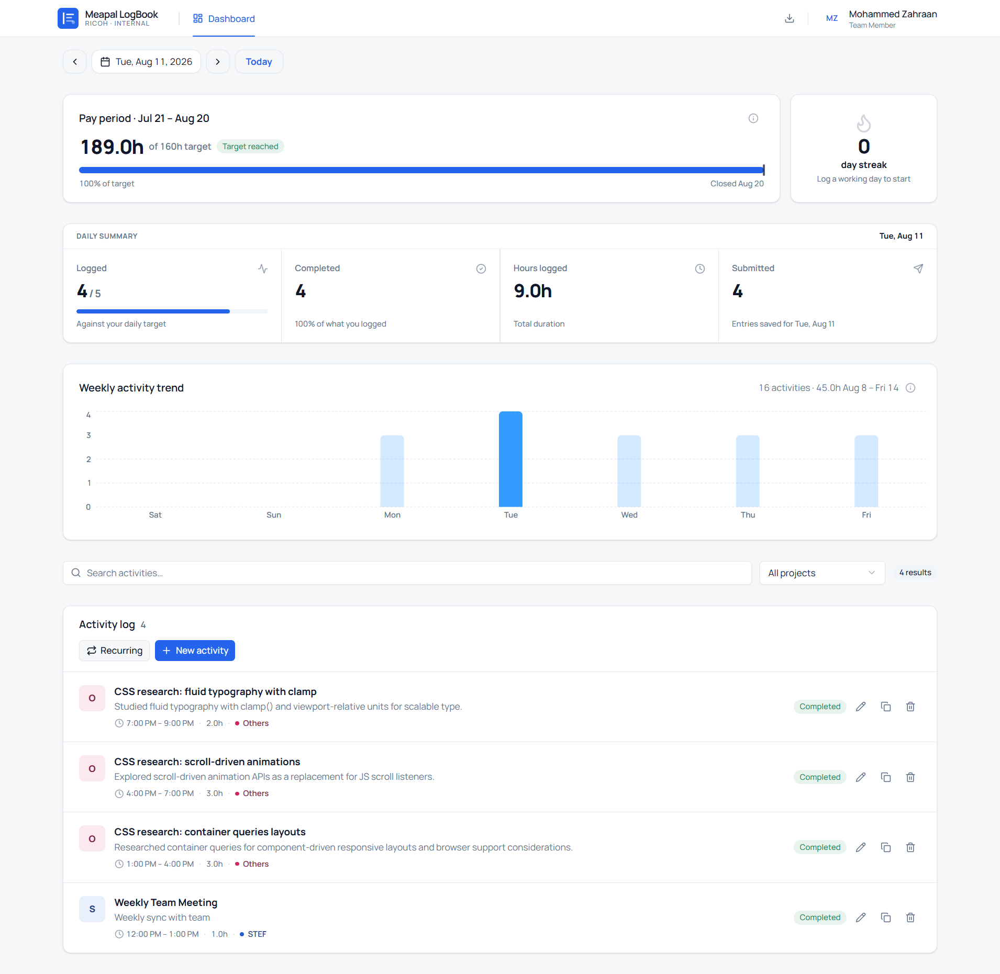

<div align="center">
  
  <h1>Meapal LogBook</h1>
  <p>A daily activity log for Ricoh / Corelia teams. Employees record what they worked on. Managers see the numbers.</p>
</div>

---



## How it works

Employees log what they worked on, day by day. Every entry has a time span, a project, and a status. That's the core of the app, and most of it exists to make that one habit easy to keep.

Around the log sit a few things that help:

- **Pay periods** run from the 21st to the 20th. A card tracks your logged hours against the period target (160h for this one) and marks where you should be by today, so falling behind is visible early instead of on day 20.
- **Streaks** count consecutive days with at least one entry. Friday and Saturday are rest days: they never break the streak, and if you work one, it counts.
- **The weekly chart** shows the Saturday-to-Friday week of whatever date you selected. Bars are clickable and open that day.
- **Reminders** appear when a working day has no entries. Rest days stay quiet.
- **Recurring templates** handle work that repeats, and any entry can be duplicated into a fresh one.

The calendar is the main control: pick a date and the pay period, the chart, and the activity list all follow. Past periods keep their own totals with a "Closed at X%" summary.

## Roles

| Role | Access |
| --- | --- |
| Employee | Daily log, streak, pay period progress, own entries |
| Project Manager | + Analytics, Reports, team projects |
| Admin | + User, team, project and competency administration |

## Getting started

You need Node 18+ and a reachable backend API.

```bash
cp .env.example .env   # point VITE_API_URL at your backend
npm install
npm run dev
```

Then open http://localhost:5173 and sign in.

> [!NOTE]
> Test accounts on the dev backend: `mmd@corelia.ai` (admin), `aka@corelia.ai` (project manager), any other `@corelia.ai` address (employee). Password `Admin@123!`.

## Scripts

| Command | What it does |
| --- | --- |
| `npm run dev` | Dev server on port 5173 |
| `npm run build` | Type-check and build to `dist/` |
| `npm run preview` | Serve the production build locally |
| `npm run lint` | ESLint |
| `npm run format` | Prettier |

## Deployment

The image ships with nginx and an SPA fallback config:

```bash
docker build -t meapal-logbook .
docker-compose up -d
```

`docker-compose.yml` expects `VITE_API_URL` at build time, so make sure `.env` is set before building.

## Stack

React 19, TypeScript, Vite, Tailwind CSS 4, shadcn/ui on Radix primitives, Framer Motion for the small animations, Recharts for the charts.

## Project structure

```
src/
├── app/             app shell: header, layout, modal coordination, shared state
├── components/ui/   shadcn/ui primitives
├── content/         in-app "What's new" release notes
├── entities/        shared domain types
├── features/        feature modules: activity, dashboard, profile, recurring, auth, ...
├── hooks/           small shared hooks
├── lib/             API clients, pay-period and work-calendar math, telemetry, utils
└── settings/        theme and container config
```

Release notes live in [CHANGELOG.md](CHANGELOG.md). The app also shows them once per release, after sign-in.
